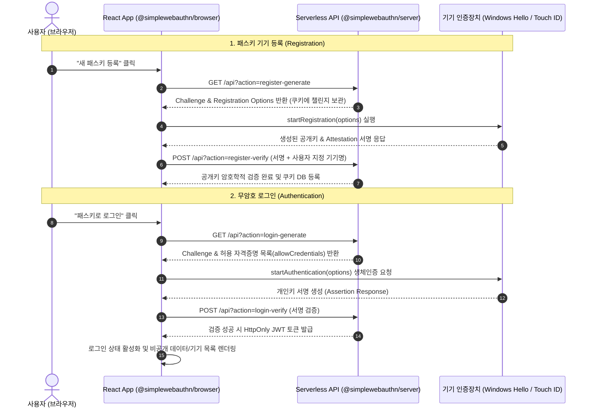

# 🌐 Front-End Developer Portfolio Web Application

> **React 19**와 **Vite 8**, 그리고 차세대 웹 표준 **WebAuthn(Passkey)** 기술을 결합하여 구현한 대화형 포트폴리오 웹 애플리케이션입니다.  
> 단순한 정적 웹페이지를 넘어, 뛰어난 사용자 경험(UX), 웹 접근성, 그리고 하드웨어 기반 무암호화 보안 인증(FIDO2)을 프론트엔드에서 직접 경험할 수 있도록 설계 및 개발되었습니다.

---

## 📌 목차 (Table of Contents)
1. [프로젝트 소개](#-프로젝트-소개-project-overview)
2. [기술 스택 (Tech Stack)](#-기술-스택-tech-stack)
3. [프론트엔드 핵심 구현 및 아키텍처](#-프론트엔드-핵심-구현-및-아키텍처-key-features)
   - [1. 단일 화면(100vh) 몰입형 레이아웃 & 대화형 뷰어](#1-단일-화면100vh-몰입형-레이아웃--대화형-인터랙티브-뷰어)
   - [2. WebAuthn(FIDO2) 기반 Passkey 무암호 인증 & 다중 기기 관리](#2-webauthnfido2-기반-passkey-무암호-인증--다중-기기-관리)
   - [3. 사용자 경험(UX) 최적화 및 스무스 네비게이션](#3-사용자-경험ux-최적화-및-스무스-네비게이션)
   - [4. 웹 접근성(A11y) 및 마이크로 인터랙션](#4-웹-접근성a11y-및-마이크로-인터랙션)
   - [5. 반응형 미디어 및 모달 오버레이 시스템](#5-반응형-미디어-및-모달-오버레이-시스템)
4. [포트폴리오 주요 프로젝트 소개](#-포트폴리오-주요-프로젝트-showcase)
   - [프로젝트 1: Gray Guard (철통 보안 사내 서버 및 인프라 설계)](#1-gray-guard-철통-보안-사내-서버-및-인프라-설계)
   - [프로젝트 2: SafeStay (호텔 통합 보안 진단 및 위협 모델링)](#2-safestay-호텔-통합-보안-진단-및-위협-모델링)
   - [프로젝트 3: Local Joy (양조장 체험 및 술 판매 통합 플랫폼)](#3-local-joy-양조장-체험-및-술-판매-통합-플랫폼)
5. [디렉토리 구조 (Directory Structure)](#-디렉토리-구조-directory-structure)
6. [실행 및 빌드 가이드 (Getting Started)](#-실행-및-빌드-가이드-getting-started)
7. [개발자 정보 (Contact)](#-개발자-정보-contact)

---

## 📖 프로젝트 소개 (Project Overview)

- **프로젝트 명**: `my-portfolio`
- **개발 형태**: 1인 풀사이클 프론트엔드 주도 개발 (기획, UI/UX 디자인, 컴포넌트 개발, 패스키 API 연동)
- **개발 목적**: 
  - 엔터프라이즈 인프라 및 보안에 대한 깊은 이해를 바탕으로, 현대적이고 견고한 프론트엔드 인터페이스를 구축하는 역량을 증명.
  - 최신 웹 생태계 트렌드(React 19, Vite, Oxlint)를 적극 채택하고, 웹 표준 생체인증 기술인 **WebAuthn(Passkey)**을 프론트엔드와 백엔드 간에 완벽히 연동하여 비밀번호 없는 안전한 개인화 영역 구현.

---

## 🛠 기술 스택 (Tech Stack)

### Front-End Core
| 분류 | 기술 | 버전 / 비고 | 설명 |
| :--- | :--- | :--- | :--- |
| **Framework** | **React** | `^19.2.8` | 최신 훅(`useState`, `useRef`, `useEffect`) 기반 상태 관리 및 컴포넌트 아키텍처 설계 |
| **Build Tool** | **Vite** | `^8.2.0` | Oxc 기반 플러그인(`@vitejs/plugin-react`)을 통한 초고속 번들링 및 HMR 환경 구축 |
| **Language** | **JavaScript (ES Modules)** | ESNext | 모던 자바스크립트 최신 문법 및 비동기 처리(`async/await`) |
| **Linter** | **Oxlint** | `^1.75.0` | Rust 기반 차세대 린터를 통한 고속 정적 코드 분석 및 코드 품질 유지 |
| **Styling** | **Pure CSS3** | Modern CSS | CSS Grid, Flexbox, Keyframes 애니메이션, 반응형 미디어 쿼리 |

### Security & Authentication
| 분류 | 기술 | 버전 / 비고 | 설명 |
| :--- | :--- | :--- | :--- |
| **Web Standard** | **@simplewebauthn/browser** | `^14.0.0` | 브라우저 FIDO2 생체인증(Touch ID, Face ID, Windows Hello) 클라이언트 로직 구현 |
| **Server Engine** | **@simplewebauthn/server** | `^14.0.0` | 패스키 챌린지 생성 및 암호학적 공개키 서명 검증 |
| **Session & Auth**| **JWT / Cookie** | `jsonwebtoken`, `cookie` | HttpOnly, Secure, SameSite=Strict 쿠키 기반의 안전한 세션 상태 동기화 |

---

## 💡 프론트엔드 핵심 구현 및 아키텍처 (Key Features)

### 1. 단일 화면(100vh) 몰입형 레이아웃 & 대화형 인터랙티브 뷰어
- **First-Screen 100vh 그리드 구성**:
  - 첫 화면에서 사용자의 시선이 분산되지 않도록 좌측의 **개발자 명함(프로필 카드)**과 우측의 **3대 핵심 역량 선택 버튼**을 2컬럼 그리드(`1fr 1.2fr`)로 균형 있게 배치했습니다.
- **상태 기반 조건부 렌더링 (State-driven Dynamic UI)**:
  - `activeTab` 상태(1, 2, 3)에 따라 하단에 해당 프로젝트의 전체 화면 상세 섹션(`full-detail-section`)이 부드러운 페이드인 애니메이션과 함께 동적으로 열립니다.

```jsx
// src/App.jsx: 탭 토글 및 스무스 스크롤 연동
const toggleTab = (index) => {
  if (activeTab === index) {
    setActiveTab(null);
    window.scrollTo({ top: 0, behavior: 'smooth' });
  } else {
    setActiveTab(index);
    setTimeout(() => {
      detailRef.current?.scrollIntoView({ behavior: 'smooth', block: 'start' });
    }, 100);
  }
};
```

---

### 2. WebAuthn(FIDO2) 기반 Passkey 무암호 인증 & 다중 기기 관리
비밀번호 유출이나 피싱의 위험이 없는 **FIDO2 / WebAuthn(패스키)** 표준 인증을 프론트엔드에서 구현했습니다.



- **다중 패스키(Multi-device Passkey) 생명주기 관리**:
  - `fetchPasskeys()`로 등록된 기기 목록(기기명, 등록 일자)을 렌더링하고, 개별 기기 삭제 기능을 제공합니다.
  - 보안을 위해 마지막 남은 패스키를 삭제할 경우 프론트엔드에서도 세션 상태를 즉시 무효화하고 자동 로그아웃을 실행하도록 상태 동기화를 완성했습니다.
- **클라이언트 비동기 예외 처리**:
  - 사용자가 생체인증 팝업을 취소하거나 기기 인증에 실패했을 때의 에러를 핸들링하여 UI가 멈추지 않도록 방어 코드를 적용했습니다.

---

### 3. 사용자 경험(UX) 최적화 및 스무스 네비게이션
- **`useRef` 기반 지능형 스크롤 제어**:
  - 탭을 클릭하면 브라우저의 기본 점프 동작 대신 `detailRef.current?.scrollIntoView({ behavior: 'smooth', block: 'start' })`를 호출하여 시각적으로 자연스럽게 상세 영역으로 유도합니다.
  - 하단의 '접기 및 위로 가기' 버튼 클릭 시 다시 화면 최상단으로 스무스하게 복귀합니다.
- **상태 시각화 피드백**:
  - 현재 활성화된 탭 버튼에 `.active` 클래스를 적용하여 배경색(`background-color: #e7f5ff`)과 텍스트 색상(`color: #1864ab`)을 강조함으로써 사용자가 현재 어느 프로젝트를 보고 있는지 즉각 인지할 수 있도록 하였습니다.

---

### 4. 웹 접근성(A11y) 및 마이크로 인터랙션
- **키보드 접근성(Keyboard Navigation)**:
  - 마우스 없이 `Tab` 키로만 이동하는 사용자를 고려하여, 인터랙티브 버튼에 고대비의 포커스 링을 선언했습니다.
  ```css
  .interactive-btn:focus {
    outline: 3px solid #339af0;
    outline-offset: 2px;
  }
  ```
- **마이크로 호버 효과**:
  - 버튼에 마우스를 올릴 때 미세하게 떠오르는 효과(`transform: translateY(-2px); transition: all 0.2s ease;`)를 주어 클릭 가능함을 시각적으로 직관화했습니다.
- **부드러운 페이드인 애니메이션**:
  - 상세 정보 박스 열람 시 `@keyframes fadeIn` 애니메이션을 주어 시각적 거부감을 줄이고 부드러운 전환 효과를 구현했습니다.

---

### 5. 반응형 미디어 및 모달 오버레이 시스템
- **반응형 16:9 비디오 래퍼**:
  - 프로젝트 시연 영상(YouTube iframe)이 어떤 디바이스 폭에서도 왜곡 없이 16:9 고정 비율을 유지하도록 패딩 비율 기법(`padding-bottom: 56.25%`)을 적용했습니다.
- **이벤트 전파 방지(Event Bubbling) 기반 모달**:
  - 첫 진입 시 나타나는 안내 팝업창에서 배경 오버레이를 클릭하면 닫히되, 알림창 내부를 클릭할 때는 닫히지 않도록 `e.stopPropagation()`을 적용하여 사용자 실수를 방지했습니다.
- **미디어 쿼리 최적화**:
  - `1366px` 이하의 노트북/태블릿 환경에서도 폰트와 그리드 간격(`gap`)을 유동적으로 줄여 가독성을 유지하도록 반응형 브레이크포인트를 설계했습니다.

---

## 🚀 포트폴리오 주요 프로젝트 (Showcase)

포트폴리오 화면에서 탭 전환을 통해 열람할 수 있는 3대 주요 프로젝트입니다.

### 1. Gray Guard: '아무도 믿지 않는다' 철통 보안 사내 서버 및 인프라 설계
- **핵심 목표**: 기업 내부망 논리적 망분리(VLAN) 및 DMZ 구성을 통해 외부 위협을 격리하고 중앙 로그 수집 가시성을 확보한 엔터프라이즈 인프라 구축
- **기술 스택**: Rocky Linux, pfSense, OpenSSH, MariaDB Replication, Apache, BIND9, Graylog, rsyslog (TLS)
- **주요 역할 및 시도**:
  - **DB 이중화 및 접근 통제**: MariaDB Master-Slave 복제 아키텍처 구축으로 읽기 부하 분산 및 고가용성 확보, DMZ/Log 서버 전용 3306 접근 제어
  - **시스템 하드닝**: `pwquality`, `faillock` 잠금 정책 및 SSH `PermitRootLogin no` 적용
  - **보안 파일 전송망**: SFTP 전용 계정 `chroot` 격리 및 `nologin` 쉘 적용
  - **암호화 로그 수집**: rsyslog TLS 전송을 통한 도청 방지 및 Graylog 중앙 통합 관제

---

### 2. SafeStay: 호텔 통합 보안 진단 및 위협 모델링
- **핵심 목표**: 호텔 예약 시스템을 외부 공격으로부터 보호하기 위해 VLAN 분리와 WAF, IDS/IPS를 결합한 다계층 심층 방어(Defense in Depth) 체계 수립
- **기술 스택**: Ubuntu 24.04, pfSense, GNS3, MariaDB, Nginx, Suricata, ModSecurity, Graylog, PMM, Shell Script
- **주요 역할 및 시도**:
  - **악성 파일 업로드 원천 차단**: 파일명/확장자 검증을 넘어 **서버 측 MIME 검사와 Magic Number 바이너리 헤더 교차 검증** 수행, 웹 루트 외부 비실행 디렉터리 격리
  - **DB 성능 모니터링**: PMM(Percona Monitoring and Management) 서버 구축을 통한 실시간 DB 메트릭 분석
  - **보안 점검 자동화**: KISA 주요 정보통신기반시설 취약점 가이드라인(U-01 ~ U-67) 기반 쉘 스크립트 작성 및 자동 진단/조치
  - **공격 시나리오 방어 검증**: Slowloris DoS 공격 방어 및 OS Command Injection 탐지 룰 검증

---

### 3. Local Joy: 양조장 체험 및 술 판매 통합 플랫폼
- **핵심 목표**: 전국 각지에 흩어진 농촌 관광 데이터와 전통주 양조장 체험 정보를 지도 중심 UI로 통합하여, 탐색에서 예약, 구매까지 끊김 없는(Seamless) 원스톱 여정 제공
- **기술 스택**: React, Kakao/Naver Map API, Node.js (Express), MariaDB, Docker, 공공데이터포털
- **주요 역할 및 시도**:
  - **지도 기반 프론트엔드 UI/UX 설계**: 전국 600여 개 양조장 데이터를 수집·가공하여 지도 위 인터랙티브 마커 및 맞춤형 필터링 UI 구현
  - **원스톱 사용자 여정 로직 설계**: `양조장 탐색 → 체험 예약 → 리뷰 작성 → 전통주 온라인 커머스 구매`로 연결되는 직관적인 프론트엔드 플로우 기획 및 프로토타입 개발
  - **타겟 맞춤형 추천 UI**: 2030 라이프스타일 소비자를 타겟으로 한 감성적이고 직관적인 양조장 큐레이션 인터페이스 구성

---

## 📂 디렉토리 구조 (Directory Structure)

```bash
my-portfolio/
├── api/                         # 서버리스 백엔드 API (WebAuthn & Auth)
│   ├── db.js                    # 인메모리/쿠키 기반 사용자 및 기기 데이터 구조
│   └── index.js                 # WebAuthn 등록/인증/검증, JWT 발급, 패스키 CRUD 핸들러
├── public/                      # 정적 에셋 (파비콘 및 프로젝트 스크린샷 이미지)
│   ├── favicon.svg              # 사이트 파비콘
│   ├── p1-1.png ~ p1-6.jpg      # Gray Guard 아키텍처 및 로그 검증 화면
│   ├── p2-1.jpg ~ p2-6.png      # SafeStay 보안 정책 및 DoS 검증 화면
│   └── p3-1.png ~ p3-6.png      # Local Joy 기획 및 UI/UX 설계 화면
├── src/                         # 프론트엔드 소스코드
│   ├── assets/                  # 빌드 에셋
│   ├── App.css                  # 레이아웃, 그리드, 반응형, 애니메이션, 접근성 스타일링
│   ├── App.jsx                  # 메인 컴포넌트 (프로필, 대화형 뷰어, 패스키 클라이언트 로직)
│   ├── index.css                # 글로벌 기본 스타일
│   └── main.jsx                 # React 19 엔트리포인트 (createRoot)
├── .oxlintrc.json               # Oxlint 정적 분석 규칙 설정
├── index.html                   # HTML 진입 템플릿
├── package.json                 # 의존성 및 프로젝트 스크립트 정의
└── vite.config.js               # Vite 빌드 설정
```

---

## ⚡ 실행 및 빌드 가이드 (Getting Started)

### 1. 패키지 설치
```bash
npm install
```

### 2. 개발 서버 구동 (Local Development)
```bash
npm run dev
```
브라우저에서 `http://localhost:5173`으로 접속합니다.

> **참고 (WebAuthn 로컬 테스트)**  
> WebAuthn(패스키)은 브라우저 보안 정책상 **HTTPS** 또는 `localhost` 환경에서만 동작합니다. 로컬 개발 환경(`localhost`)에서는 별도의 인증서 없이 기기의 Windows Hello / Touch ID를 이용해 패스키 등록 및 로그인을 테스트할 수 있습니다.

### 3. 코드 린트 검사
```bash
npm run lint
```

### 4. 프로덕션 빌드
```bash
npm run build
```

---

## 👨‍💻 개발자 정보 (Contact)

- **이름**: 문경구 (Moon Gyeong-Gu)
- **이메일**: [lion989072@gmail.com](mailto:lion989072@gmail.com)
- **GitHub**: [@gyeonggumun](https://github.com/gyeonggumun)
- **소속 / 과정**: SKT K-디지털 트레이닝 (K-뉴딜 부산 A반)
