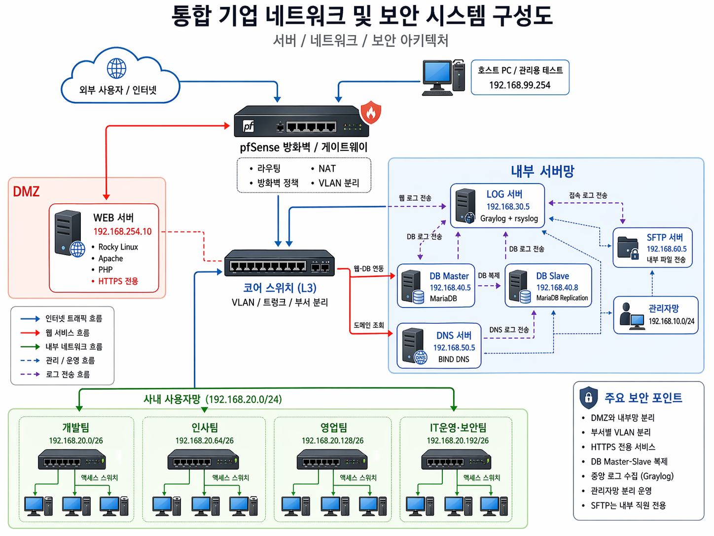
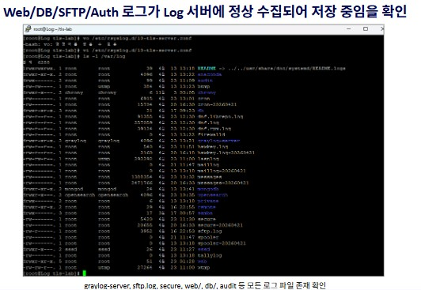
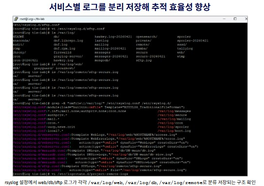
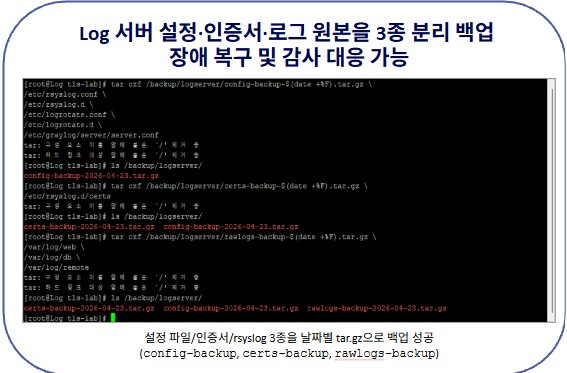

# GrayGuard | 기업 보안 인프라 프로젝트

> 부서별 네트워크를 분리하고 Web, DB, DNS, SFTP, Log 서버를 필요한 통신만 허용하는 구조로 연결한 팀 프로젝트입니다. 저는 서버 구축을 맡아 MariaDB 복제와 서버 보안 설정을 중심으로 작업했습니다.

| 기간 | 팀 | 나의 역할 |
| --- | --- | --- |
| 2026.04.13–04.24 | 이스트캠프 가디언즈 1차 프로젝트, Infra SEC (최종 3명) | 서버 담당: MariaDB 복제, DNS·SFTP 및 계정 보안 설정 |

<table>
  <tr>
    <td width="55%" valign="top">
      <h2>한눈에 보기</h2>
      <p><strong>목표</strong><br>DMZ와 내부 서버망, 부서별 사용자망을 분리하고 Web–DB 접근, 내부 파일 전송, 중앙 로그 수집에 필요한 경로를 통제했습니다.</p>
      <p><strong>내가 맡은 일</strong></p>
      <ul>
        <li>MariaDB Master–Slave 복제 구성과 DB 계정·감사 로그·백업·TLS 설정</li>
        <li>BIND9 DNS 질의 범위 제한과 SFTP 계정의 <code>chroot</code> 격리</li>
        <li>서버 계정 비밀번호 정책, 로그인 실패 잠금, SSH root 직접 접속 제한</li>
      </ul>
      <p><strong>핵심 교훈</strong><br>복제와 백업을 구성하는 것만으로 장애 복구가 끝나지 않습니다. 연결·권한·로그를 확인하고, 복원과 장애 전환은 별도 시험으로 입증해야 합니다.</p>
    </td>
    <td width="45%" valign="top">
      
      <p><sub>프로젝트 네트워크 구성도. 설계된 전체 구조를 보여주며 각 구간의 운영 검증 범위와는 구분합니다.</sub></p>
    </td>
  </tr>
</table>

## 프로젝트 목표와 구조

기업 내부 인프라를 가정해 외부에 공개되는 Web 서버를 DMZ에 두고, DB·DNS·SFTP·Log 서버를 내부망에 배치했습니다. 부서별 사용자망은 VLAN으로 나누고 pfSense 정책으로 서비스에 필요한 통신을 허용하는 방식입니다. 모든 서버의 로그는 rsyslog를 거쳐 Log 서버와 Graylog로 모으도록 설계했습니다.

```text
외부 사용자 → pfSense → Web(DMZ) → MariaDB
내부 직원 ──────────────→ SFTP(부서별 계정 격리)
내부 서버 ── rsyslog/TLS ─→ Log 서버 → Graylog
```

이 구성은 팀 전체 결과입니다. 네트워크 설계·pfSense 정책·Web 서버·Graylog의 기초 구축을 제 개인 작업으로 표기하지 않았습니다.

## 나의 역할과 구현

### 1. MariaDB 복제와 데이터 보호

- Master–Slave 복제를 구성하고 복제 상태를 확인했습니다. 프로젝트 회고에는 이 작업을 통해 DB 이중화와 가용성의 중요성을 배웠다고 기록했습니다.
- DB 계정에 비밀번호 복잡도 정책을 적용하고, 접속·권한 변경 이벤트를 추적할 수 있도록 `server_audit`를 설정했습니다.
- 백업 전용 계정에 필요한 권한만 부여하고 `mariabackup` 전체 백업의 완료와 날짜별 디렉터리 생성을 확인했습니다.
- 자체 CA와 서버 인증서를 생성해 MariaDB TLS 설정을 적용했습니다. 보고서에는 인증서 검증과 서버 재시작 화면이 남아 있습니다.

### 2. DNS·SFTP와 서버 접근 제어

- BIND9에서 신뢰된 내부 대역의 질의만 허용하고 Zone 전송을 제한했습니다.
- 부서별 SFTP 계정을 만들고 `nologin`으로 쉘 로그인을 막았습니다. `Match Group sftpusers`와 `chroot`로 파일 접근 범위를 분리하고 포트 포워딩을 차단했습니다.
- 공통 서버 설정에 비밀번호 품질·만료 정책, 로그인 실패 잠금, SSH root 직접 로그인 차단을 적용했습니다.

### 3. 팀 통합과 확인

Web–DB 연결, 내부 DNS 질의, SFTP 접속, 중앙 로그 수신을 팀과 함께 확인했습니다. 결과보고서에는 HTTP→HTTPS 전환, root SSH 접속 차단, SFTP 격리, rsyslog 로그 수신 확인 등의 시연 항목이 기록돼 있습니다.

## 결과와 근거

| 확인한 항목 | 남아 있는 근거 | 해석 범위 |
| --- | --- | --- |
| DB 복제·백업·TLS 설정 | 결과보고서의 DB 구성, 백업 완료, 인증서 검증 화면 | 자동 장애 전환과 백업 복원 시험까지 입증하는 자료는 아님 |
| 부서별 파일 접근 제한 | SFTP 계정, `nologin`, `chroot` 설정 및 접속 시연 | 외부 인터넷 서비스로 운영한 결과는 아님 |
| 중앙 로그 수집 | Web·DB·SFTP·인증 로그의 수신 및 서비스별 저장 화면 | Graylog 기초 구축은 팀원 담당 |
| 주기 점검·백업 | Log 서버 점검 스크립트와 설정·인증서·원본 로그 백업 화면 | 오류 자동 판정·자동 복구·장기 이력은 구현 근거가 없음 |

<table>
  <tr>
    <td width="50%" valign="top"><br><sub>부서별 망과 서버망 구성</sub></td>
    <td width="50%" valign="top"><br><sub>여러 서버의 로그 수신 확인</sub></td>
  </tr>
  <tr>
    <td width="50%" valign="top"><br><sub>서비스별 로그 분리 저장</sub></td>
    <td width="50%" valign="top"><br><sub>설정·인증서·로그 백업</sub></td>
  </tr>
  <tr>
    <td width="50%" valign="top"><br><sub>10분 간격 Log 서버 점검 스크립트</sub></td>
    <td width="50%" valign="top"><strong>이미지 읽는 법</strong><p>이 화면들은 팀 프로젝트의 아키텍처와 검증 자료입니다. 제 개인 구현 범위는 위 ‘나의 역할과 구현’에 따로 명시했습니다.</p></td>
  </tr>
</table>

## 어려웠던 점과 배운 점

- **서버 기능과 정책의 균형:** 연결을 막기만 하면 Web–DB, DNS, SFTP 기능도 함께 멈춥니다. 서비스 흐름을 먼저 정리하고 필요한 목적지와 포트만 허용하는 방식으로 팀 통합을 진행했습니다.
- **복제와 복구의 차이:** Master–Slave 복제와 백업 성공은 확인했지만, 실제 백업 복원이나 자동 장애 전환은 별도 검증이 필요합니다. 이후 프로젝트에서는 복원 절차와 장애 상황 시험을 먼저 계획해야 한다는 점을 배웠습니다.
- **운영 증거의 중요성:** 설정 파일만으로는 동작을 설명하기 어렵습니다. 접속·차단·로그 수신 결과를 함께 남겨야 보안 정책을 검토하고 인계할 수 있습니다.

## 기술 스택

`Rocky Linux` · `MariaDB` · `BIND9` · `OpenSSH/SFTP` · `rsyslog` · `Graylog` · `pfSense` · `Apache/PHP`

> **범위:** 교육용 내부 실습망 프로젝트입니다. 결과보고서에는 실장비·실트래픽 부하 시험, 외부 인터넷 서비스, WAF·IDS/IPS 구축이 완료되지 않은 항목으로 정리돼 있습니다.

### 자료 기준

이 문서는 팀의 1차 프로젝트 계획서·결과보고서와 저장소의 프로젝트 이미지를 바탕으로 작성했습니다. 다른 팀원의 포트폴리오는 설명 방식만 참고했고, 그 사람의 역할·성과를 제 작업으로 옮기지 않았습니다.
